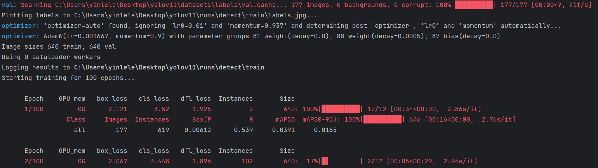
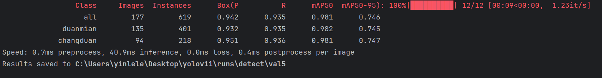

# YOLOv11
大道至简，仅需三行代码训练YOLOv11。

## 配置教程

- 克隆项目
```
git clone https://github.com/li-yibing/yolov11.git
```
国内加速链接：
```
git clone https://gitee.com/ybli_code/yolov11.git
```

- 安装依赖
```shell
pip install -r requirements.txt
```

- 推理图像
```shell
python predict.py
```
推理结果：


- 训练模型
将自己的数据集放在datasets文件夹。
如果你没有自己的数据集可以下载样例：https://pan.quark.cn/s/78036eeef5b3
```shell
python train.py
```
训练日志：


- 验证模型
```shell
python test.py
```
验证日志：



## 项目目录简介
```
datasets/ # 数据集
images/ # 测试图片
res/ # 文档资源
predict.py # 模型推理
train.py # 模型训练
test.py # 模型验证
```